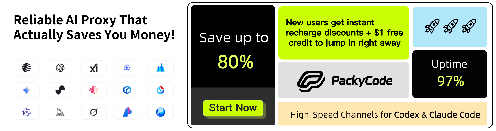

# CLIProxyAPI Plus

English | [Chinese](README_CN.md)

This is the Plus version of [CLIProxyAPI](https://github.com/router-for-me/CLIProxyAPI), adding support for third-party providers on top of the mainline project.

> [!NOTE]
> Upstream reference (for baseline behavior/docs): https://github.com/luispater/CLIProxyAPI/blob/main/README.md

---

> [!IMPORTANT]
> ## This is a fork (read me first)
> This repository is a fork/derivative build of CLIProxyAPI.
>
> **Motivation:** make it easy to use your *existing* AI subscriptions (Claude Code, Codex, Gemini, Copilot, etc.) from any OpenAI-compatible client/SDK and from multiple coding CLIs — locally or hosted — without rewriting tooling.
>
> **What’s different from upstream (and why):**
>
> - **More provider adapters & auth flows (Copilot, Grok, etc.)** — so you can route requests through the subscription/provider you already pay for, using a consistent OpenAI-compatible API surface.
> - **Cursor Composer 2.5 (API key + SDK sidecar)** — route `composer-2.5` and related models through your Cursor subscription via `CURSOR_API_KEY` / `cursor-api-key` YAML. By default ("Cursor Composer Client-Tools"), the patched `@cursor/sdk` agent bridge (`sidecars/cursor-bridge/cursor-agent-bridge.mjs`) owns all Cursor I/O and every tool executes on the client through CLIProxy. Railway starts the bridge on `CURSOR_AGENT_BRIDGE_PORT` (default `9798`) automatically when `CURSOR_API_KEY` is set; set `CURSOR_DIRECT=1` only to opt into the gated legacy direct path.
> - **Chutes provider support (API key + dynamic model discovery)** — optionally expose Chutes-hosted models via OpenAI-compatible endpoints using `CHUTES_API_KEY` / `CHUTES_BASE_URL`. Supports configurable retry logic with `CHUTES_MAX_RETRIES` (default: 4) and `CHUTES_RETRY_BACKOFF` (default: `5,15,30,60` seconds).
> - **Passthru model routing (env + YAML)** — declare arbitrary model IDs (e.g. `glm-4.7`) that are forwarded to external upstream APIs (OpenAI-compatible / Anthropic / Responses), with per-route API keys/headers; ideal for hosted deployments (Railway) via `PASSTHRU_MODELS_JSON`.
> - **Railway-first deployment path** (`scripts/railway_start.sh`, `docs/RAILWAY_GUIDE.md`) — to make it dead simple to spin up a personal, always-on CLIProxyAPI instance you can call from anywhere.
>   - Log in locally (interactive browser/device flows), then package credentials into `AUTH_BUNDLE` via `scripts/auth_bundle.sh` and restore them in a remote environment.
> - **Hosted-friendly credential transfer** (`AUTH_BUNDLE`/`AUTH_ZIP_URL`) — avoids having to manually copy lots of files/secrets around when deploying.
> - **Compatibility emphasis (including Responses-style clients)** — so tools expecting OpenAI-compatible endpoints “just work” with minimal configuration.
> - **One config, many tools** — point Claude Code / Codex CLI / Gemini-compatible clients / IDE extensions at one base URL and let the proxy handle provider routing and account management.
>
> If you only want the upstream behavior/features, compare against the original upstream repository and docs.

> Recommended companion tools / related forks:
>
> - **Patch-22** (recommended): a tiny `apply_patch` safety net binary/script for when a model tries to run `apply_patch` as a shell command: [`github.com/jeffnash/patch-22`](https://github.com/jeffnash/patch-22).
> - **Letta Code (jeffnash fork)**: [`github.com/jeffnash/letta-code`](https://github.com/jeffnash/letta-code) is wired up to route main model calls through a hosted `jeffnash/CLIProxyAPI` instance.
> - **Letta (jeffnash fork)**: [`github.com/jeffnash/letta`](https://github.com/jeffnash/letta) includes scripts to deploy the Letta server to Railway and pairs well with this proxy.

---

All third-party provider support is maintained by community contributors; CLIProxyAPI does not provide technical support. Please contact the corresponding community maintainer if you need assistance.

A proxy server that provides OpenAI/Gemini/Claude/Codex/Grok compatible API interfaces for CLI.

It now also supports OpenAI Codex (GPT models) and Claude Code via OAuth.

The Plus release stays in lockstep with the mainline features.

## Differences from the Mainline

This project is sponsored by Z.ai, supporting us with their GLM CODING PLAN.

GLM CODING PLAN is a subscription service designed for AI coding, starting at just $3/month. It provides access to their flagship GLM-4.7 model across 10+ popular AI coding tools (Claude Code, Cline, Roo Code, etc.), offering developers top-tier, fast, and stable coding experiences.

Get 10% OFF GLM CODING PLAN：https://z.ai/subscribe?ic=8JVLJQFSKB

---

<table>
<tbody>
<tr>
<td width="180"></td>
<td>Thanks to PackyCode for sponsoring this project! PackyCode is a reliable and efficient API relay service provider, offering relay services for Claude Code, Codex, Gemini, and more. PackyCode provides special discounts for our software users: register using <a href="https://www.packyapi.com/register?aff=cliproxyapi">this link</a> and enter the "cliproxyapi" promo code during recharge to get 10% off.</td>
</tr>
<tr>
<td width="180"></td>
<td>Thanks to Cubence for sponsoring this project! Cubence is a reliable and efficient API relay service provider, offering relay services for Claude Code, Codex, Gemini, and more. Cubence provides special discounts for our software users: register using <a href="https://cubence.com/signup?code=CLIPROXYAPI&source=cpa">this link</a> and enter the "CLIPROXYAPI" promo code during recharge to get 10% off.</td>
</tr>
</tbody>
</table>

## Fork-Focused Quickstart

This fork is primarily optimized for:

- Using **OAuth/subscription logins** (Codex / Claude Code / Gemini / Copilot / etc.) behind an OpenAI-compatible base URL
- **Hosting your own personal instance** (especially on Railway) so you can call it from anywhere

Key docs:

- End-user Railway deployment: `docs/RAILWAY_GUIDE.md`
- Railway Copilot Electron shim: `docs/RAILWAY_ELECTRON_SHIM.md`
- Railway scripts reference: `scripts/README_RAILWAY.md`
- SDK usage (embed the proxy in Go): `docs/sdk-usage.md`
- SDK advanced: `docs/sdk-advanced.md`
- SDK access/auth: `docs/sdk-access.md`
- Credential watching: `docs/sdk-watcher.md`

Provider & config matrix (fork-specific):

| Topic | Where | Notes |
| :--- | :--- | :--- |
| Provider login commands (Gemini / Claude / Codex / Copilot / Grok / Qwen / iFlow / Antigravity / Vertex) | `docs/RAILWAY_GUIDE.md` | See the “Local Authentication” table for exact `--*-login` flags. |
| Grok support | `docs/RAILWAY_GUIDE.md` | Uses `--grok-login` (SSO cookies flow). |
| Copilot support | `docs/RAILWAY_GUIDE.md` | Uses `--copilot-login` (device code flow). |
| Cursor Composer support | `internal/config/config.go` / `scripts/README_RAILWAY.md` | Env: `CURSOR_API_KEY` (also `cursor-api-key` in YAML). Sidecar: `sidecars/cursor-bridge/cursor-agent-bridge.mjs` (patched `@cursor/sdk` agent bridge, [Railpack Node 22](https://railpack.com/languages/node)) on `CURSOR_AGENT_BRIDGE_PORT` (default `9798`). Bridge tuning: `CURSOR_AGENT_BRIDGE_URL`, `CURSOR_AGENT_STATE_ROOT`; `CURSOR_DIRECT=1` opts into the gated legacy direct path. Railway: set `RAILPACK_PACKAGES=go@1.26 node@22`. Models: `composer-2.5`, `composer-2.5-fast`, etc. |
| Claude Code → Cursor via proxy | `scripts/claude-code-cursor.sh` | `source scripts/claude-code-cursor.sh on` points Claude Code at CLIProxyAPI; local auth uses `ignored` (must match `api-keys` in config). |
| Railway env vars (auth transfer) | `scripts/README_RAILWAY.md` | `AUTH_BUNDLE` or `AUTH_ZIP_URL`, plus `API_KEY_1`, optional `AUTH_DIR_NAME`, `FORCE_BUILD`, optional `CURSOR_API_KEY`. |
| Copilot initiator behavior | `internal/runtime/executor/copilot_headers.go` | Default is `X-Initiator: agent` for Copilot requests. Trusted internal callers can override via request header `force-copilot-initiator: user` (used by Copilot Hot Takes). |
| Copilot config keys (YAML) | `internal/config/config.go` | Look under `CopilotKey` config + related fields for the authoritative schema (initiator flags + header profile selection). |
| Copilot header behavior | `internal/runtime/executor/copilot_headers.go` | Implementation for request header shaping / agent-call behavior + optional header profile emulation. |
| Copilot model registry | `internal/registry/copilot_models.go` | How Copilot models are enumerated/aliased. |
| Force Copilot routing | `sdk/api/handlers/handlers.go` / `sdk/cliproxy/auth/conductor.go` | Use `copilot-<model>` to explicitly route to Copilot even if the model isn't registered; bypasses client model support filtering. |
| Force Codex routing | `sdk/api/handlers/handlers.go` / `sdk/cliproxy/auth/conductor.go` | Use `codex-<model>` to explicitly route to Codex; sets `forced_provider=true` to bypass client model support filtering. |
| Force Kimi routing | `sdk/api/handlers/handlers.go` / `sdk/cliproxy/auth/conductor.go` | Use `kimi-<model>` to explicitly route to Kimi; sets `forced_provider=true` to bypass client model support filtering. |
| Force iFlow routing | `sdk/api/handlers/handlers.go` / `sdk/cliproxy/auth/conductor.go` | Use `iflow-<model>` to explicitly route to iFlow; sets `forced_provider=true` to bypass client model support filtering. |
| Copilot Hot Takes | `internal/cmd/copilot_hot_takes.go` / `docs/RAILWAY_GUIDE.md` | Optional background job controlled by `COPILOT_HOT_TAKES_INTERVAL_MINS` and `COPILOT_HOT_TAKES_MODEL`. |
| Grok config schema | `internal/config/config.go` | `GrokKey` and `GrokConfig` sections define available knobs. |
| Chutes support (env + YAML) | `internal/config/config.go` / `docs/RAILWAY_GUIDE.md` | Env vars: `CHUTES_API_KEY`, `CHUTES_BASE_URL`, `CHUTES_MODELS`, `CHUTES_MODELS_EXCLUDE`, `CHUTES_PRIORITY`, `CHUTES_TEE_PREFERENCE`, `CHUTES_PROXY_URL`, `CHUTES_MAX_RETRIES`. YAML: `chutes` section. |
| Force Chutes routing | `sdk/api/handlers/handlers.go` / `sdk/cliproxy/auth/conductor.go` | Use `chutes-<model>` to explicitly route to Chutes; sets `forced_provider=true` to bypass client model support filtering. |
| Chutes model aliasing + fallbacks | `internal/registry/chutes_models.go` | Generates `chutes-` aliases for explicit routing + contains conservative fallback models. |
| Chutes executor | `internal/runtime/executor/chutes_executor.go` | Implements OpenAI-compatible chat completions + streams, model fetch/cache, and token counting. |
| Chutes priority filtering | `sdk/cliproxy/service.go` / `sdk/cliproxy/chutes_priority_hook.go` | `CHUTES_PRIORITY=fallback` hides non-prefixed Chutes IDs when another provider has the same model ID; `chutes-` aliases remain routable. |
| OAuth excluded models | `internal/config/config.go` | `oauth-excluded-models` config lets you disable models per provider. |
| OpenAI-compat upstreams | `internal/config/config.go` | `openai-compatibility` for routing to other OpenAI-compatible providers. |
| Routing behavior | `internal/config/config.go` | `routing` config controls credential selection/failover. |

### Copilot initiator (fork default)

This fork defaults Copilot requests to `X-Initiator: agent`.

Trusted internal callers can override the initiator with the request header:

- `force-copilot-initiator: user|agent`

This is used for opt-in background jobs (see Copilot Hot Takes in `docs/RAILWAY_GUIDE.md`).

### Chutes config (quick explainer)

Chutes is an optional OpenAI-compatible upstream. You can route to it either explicitly (recommended) or by exposing non-prefixed IDs.

- Explicit routing: set `model: "chutes-<model>"` (works as long as Chutes is configured).
- Env vars:
  - `CHUTES_API_KEY` (required), `CHUTES_BASE_URL` (optional)
  - `CHUTES_MODELS` / `CHUTES_MODELS_EXCLUDE` (optional allow/block lists)
  - `CHUTES_PRIORITY` (`fallback` default hides non-prefixed IDs when another provider offers the same ID; `primary` exposes them)
  - `CHUTES_TEE_PREFERENCE` (`prefer` default), `CHUTES_PROXY_URL` (optional)
  - `CHUTES_MAX_RETRIES` (default `4`; set `0` to disable) — retries intermittent 429s

If you want the baseline upstream documentation/behavior, start here: https://github.com/luispater/CLIProxyAPI/blob/main/README.md

If you want more details (and exact env vars), see `docs/RAILWAY_GUIDE.md` and `scripts/README_RAILWAY.md`.

---

> Note: this fork’s docs intentionally focus on fork-specific behavior; the upstream README is the best reference for the baseline project.

---

Hosted instance goals:

- Log in locally once, then transfer credentials via `scripts/auth_bundle.sh` (`AUTH_BUNDLE`) to your host.
- Point your clients/tools at your hosted base URL and keep using the same API key.

## Capabilities (Fork)

- OpenAI-compatible API endpoints for chat + tools (plus provider routing)
- OAuth/cookie login flows for multiple providers and multi-account load balancing
- Streaming + non-streaming responses, multimodal inputs (where supported)
- Compatibility targets: OpenAI-compatible clients/SDKs (including Responses-style clients) + coding CLIs

## Getting Started

CLIProxyAPI Guides: [https://help.router-for.me/](https://help.router-for.me/)

## Management API

see [MANAGEMENT_API.md](https://help.router-for.me/management/api)

## Who is with us?

Those projects are based on CLIProxyAPI:

### [vibeproxy](https://github.com/automazeio/vibeproxy)

Native macOS menu bar app to use your Claude Code & ChatGPT subscriptions with AI coding tools - no API keys needed

### [Subtitle Translator](https://github.com/VjayC/SRT-Subtitle-Translator-Validator)

Browser-based tool to translate SRT subtitles using your Gemini subscription via CLIProxyAPI with automatic validation/error correction - no API keys needed

- Added GitHub Copilot support (OAuth login), provided by [em4go](https://github.com/em4go/CLIProxyAPI/tree/feature/github-copilot-auth)
- Added Kiro (AWS CodeWhisperer) support (OAuth login), provided by [fuko2935](https://github.com/fuko2935/CLIProxyAPI/tree/feature/kiro-integration), [Ravens2121](https://github.com/Ravens2121/CLIProxyAPIPlus/)

### [CCS (Claude Code Switch)](https://github.com/kaitranntt/ccs)

CLI wrapper for instant switching between multiple Claude accounts and alternative models (Gemini, Codex, Antigravity) via CLIProxyAPI OAuth - no API keys needed

### [ProxyPal](https://github.com/heyhuynhgiabuu/proxypal)

Native macOS GUI for managing CLIProxyAPI: configure providers, model mappings, and endpoints via OAuth - no API keys needed.

> [!NOTE]
> If you developed a project based on CLIProxyAPI, please open a PR to add it to this list.

## Sponsor

Thanks to PackyCode for sponsoring this project!

PackyCode is a reliable and efficient API relay service provider, offering relay services for Claude Code, Codex, Gemini, and more.

PackyCode provides special discounts for our software users: register using <a href="https://www.packyapi.com/register?aff=cliproxyapi">this link</a> and enter the "cliproxyapi" promo code during recharge to get 10% off.

---

<table>
<tbody>
<tr>
<td width="180"></td>
<td>Thanks to AICodeMirror for sponsoring this project! AICodeMirror provides official high-stability relay services for Claude Code / Codex / Gemini CLI, with enterprise-grade concurrency, fast invoicing, and 24/7 dedicated technical support. Claude Code / Codex / Gemini official channels at 38% / 2% / 9% of original price, with extra discounts on top-ups! AICodeMirror offers special benefits for CLIProxyAPI users: register via <a href="https://www.aicodemirror.com/register?invitecode=TJNAIF">this link</a> to enjoy 20% off your first top-up, and enterprise customers can get up to 25% off!</td>
</tr>
<tr>
<td width="180"></td>
<td>Huge thanks to BmoPlus for sponsoring this project! BmoPlus is a highly reliable AI account provider built strictly for heavy AI users and developers. They offer rock-solid, ready-to-use accounts and official top-up services for ChatGPT Plus / ChatGPT Pro (Full Warranty) / Claude Pro / Super Grok / Gemini Pro. By registering and ordering through <a href="https://shop.bmoplus.com/?utm_source=github">BmoPlus - Premium AI Accounts & Top-ups</a>, users can unlock the mind-blowing rate of <b>10% of the official GPT subscription price (90% OFF)</b>!</td>
</tr>
<tr>
<td width="180"></td>
<td>Thanks to <b>VisionCoder</b> for supporting this project. <a href="https://coder.visioncoder.cn" target="_blank">VisionCoder Developer Platform</a> is a reliable and efficient API relay service provider, offering access to mainstream AI models such as Claude Code, Codex, and Gemini. It helps developers and teams integrate AI capabilities more easily and improve productivity.

VisionCoder is also offering our users a limited-time <a href="https://coder.visioncoder.cn" target="_blank">Token Plan</a> promotion: <b>buy 1 month and get 1 month free</b>.</td>
</tr>
<tr>
<td width="180"></td>
<td>Thanks to APIKEY.FUN for sponsoring this project! APIKEY.FUN is a professional enterprise-grade AI relay platform dedicated to providing stable, efficient, and low-cost AI model API access for enterprises and individual developers. The platform supports popular mainstream models such as Claude, OpenAI, and Gemini, with prices as low as 7% of the official price. Register through this project's <a href="https://apikey.fun/register?aff=CLIProxyAPI">exclusive link</a> to enjoy a special <b>permanent 5% top-up discount</b>.</td>
</tr>
<tr>
<td width="180"></td>
<td>RunAPI is an efficient and stable API platform—an alternative to OpenRouter. A single API Key gives you access to 150+ leading models, including OpenAI, Claude, Gemini, DeepSeek, Grok, and more, at prices as low as 10% of the original (up to 90% off), with exceptional stability. It's seamlessly compatible with tools like Claude Code, OpenClaw, and others. RunAPI offers an exclusive perk for CPA users: <a href="https://runapi.co/register?aff=FivD">register</a> and contact an administrator to claim ¥7 in free credit.</td>
</tr>
<tr>
<td width="180"></td>
<td>Thanks to Unity2.ai for sponsoring this project! Unity2.ai is a high-performance AI model API relay platform for individual developers, teams, and enterprises. It has long served leading domestic enterprises, handles more than 30 billion token calls per day, and supports high concurrency at the 5000 RPM level. It supports balance billing, first top-up bonuses, bundled subscriptions, enterprise invoicing, and dedicated integration support. Register through <a href="https://unity2.ai/register?source=cliproxyapi">this link</a> to receive a $2 balance, then join the official group to get another $10 balance, for up to $12 in free credit.</td>
</tr>
</tbody>
</table>

## Overview

- OpenAI/Gemini/Claude/Grok compatible API endpoints for CLI models
- OpenAI Codex support (GPT models) via OAuth login
- Claude Code support via OAuth login
- Grok Build support via OAuth login
- Amp CLI and IDE extensions support with provider routing
- Streaming, non-streaming, and WebSocket responses where supported
- Function calling/tools support
- Multimodal input support (text and images)
- Multiple accounts with round-robin load balancing (Gemini, OpenAI, Claude, Grok)
- Simple CLI authentication flows (Gemini, OpenAI, Claude, Grok)
- Generative Language API Key support
- AI Studio Build multi-account load balancing
- Gemini CLI multi-account load balancing
- Claude Code multi-account load balancing
- OpenAI Codex multi-account load balancing
- Grok Build multi-account load balancing
- OpenAI-compatible upstream providers via config (e.g., OpenRouter)
- Reusable Go SDK for embedding the proxy (see `docs/sdk-usage.md`)

## Getting Started

CLIProxyAPI Guides: [https://help.router-for.me/](https://help.router-for.me/)

## Management API

see [MANAGEMENT_API.md](https://help.router-for.me/management/api)

## Usage Statistics

Since v6.10.0, CLIProxyAPI and [CPAMC](https://github.com/router-for-me/Cli-Proxy-API-Management-Center) no longer ship built-in usage statistics. If you need usage statistics, use:

### [CPA Usage Keeper](https://github.com/Willxup/cpa-usage-keeper)

Standalone persistence and visualization service for CLIProxyAPI, with periodic data sync, SQLite storage, aggregate APIs, and a built-in dashboard for usage and statistics.

### [CPA-Manager-Plus](https://github.com/seakee/CPA-Manager-Plus)

Full CLIProxyAPI management center with request-level monitoring and cost estimates. CPA-Manager tracks collected requests by account, model, channel, latency, status, and token usage; estimates cost with editable model prices and one-click LiteLLM price sync; persists events in SQLite; and provides Codex account-pool operations with batch inspection, quota detection, unhealthy account discovery, cleanup suggestions, and one-click execution for day-to-day multi-account maintenance.

## SDK Docs

- Usage: [docs/sdk-usage.md](docs/sdk-usage.md)
- Advanced (executors & translators): [docs/sdk-advanced.md](docs/sdk-advanced.md)
- Access: [docs/sdk-access.md](docs/sdk-access.md)
- Watcher: [docs/sdk-watcher.md](docs/sdk-watcher.md)
- Custom Provider Example: `examples/custom-provider`

## Contributing

Contributions are welcome! Please feel free to submit a Pull Request.

1. Fork the repository
2. Create your feature branch (`git checkout -b feature/amazing-feature`)
3. Commit your changes (`git commit -m 'Add some amazing feature'`)
4. Push to the branch (`git push origin feature/amazing-feature`)
5. Open a Pull Request

## Who is with us?

Those projects are based on CLIProxyAPI:

### [vibeproxy](https://github.com/automazeio/vibeproxy)

Native macOS menu bar app to use your Claude Code & ChatGPT subscriptions with AI coding tools - no API keys needed

### [Subtitle Translator](https://github.com/VjayC/SRT-Subtitle-Translator-Validator)

A cross-platform desktop and web app to translate and validate SRT subtitles using your existing LLM subscriptions (Gemini, ChatGPT, Claude, etc.) via CLIProxyAPI - no API keys needed.

### [CCS (Claude Code Switch)](https://github.com/kaitranntt/ccs)

CLI wrapper for instant switching between multiple Claude accounts and alternative models (Gemini, Codex, Antigravity) via CLIProxyAPI OAuth - no API keys needed

### [Quotio](https://github.com/nguyenphutrong/quotio)

Native macOS menu bar app that unifies Claude, Gemini, OpenAI, and Antigravity subscriptions with real-time quota tracking and smart auto-failover for AI coding tools like Claude Code, OpenCode, and Droid - no API keys needed.

### [ProxyPilot](https://github.com/Finesssee/ProxyPilot)

Windows-native CLIProxyAPI fork with TUI, system tray, and multi-provider OAuth for AI coding tools - no API keys needed.

### [Claude Proxy VSCode](https://github.com/uzhao/claude-proxy-vscode)

VSCode extension for quick switching between Claude Code models, featuring integrated CLIProxyAPI as its backend with automatic background lifecycle management.

### [ZeroLimit](https://github.com/0xtbug/zero-limit)

Windows desktop app built with Tauri + React for monitoring AI coding assistant quotas via CLIProxyAPI. Track usage across Gemini, Claude, OpenAI Codex, and Antigravity accounts with real-time dashboard, system tray integration, and one-click proxy control - no API keys needed.

### [CPA-XXX Panel](https://github.com/ferretgeek/CPA-X)

A lightweight web admin panel for CLIProxyAPI with health checks, resource monitoring, real-time logs, auto-update, request statistics and pricing display. Supports one-click installation and systemd service.

### [CLIProxyAPI Tray](https://github.com/kitephp/CLIProxyAPI_Tray)

A Windows tray application implemented using PowerShell scripts, without relying on any third-party libraries. The main features include: automatic creation of shortcuts, silent running, password management, channel switching (Main / Plus), and automatic downloading and updating.

### [霖君](https://github.com/wangdabaoqq/LinJun)

霖君 is a cross-platform desktop application for managing AI programming assistants, supporting macOS, Windows, and Linux systems. Unified management of Claude Code, Gemini CLI, OpenAI Codex, and other AI coding tools, with local proxy for multi-account quota tracking and one-click configuration.

### [CLIProxyAPI Dashboard](https://github.com/itsmylife44/cliproxyapi-dashboard)

A modern web-based management dashboard for CLIProxyAPI built with Next.js, React, and PostgreSQL. Features real-time log streaming, structured configuration editing, API key management, OAuth provider integration for Claude/Gemini/Codex, usage analytics, container management, and config sync with OpenCode via companion plugin - no manual YAML editing needed.

### [All API Hub](https://github.com/qixing-jk/all-api-hub)

Browser extension for one-stop management of New API-compatible relay site accounts, featuring balance and usage dashboards, auto check-in, one-click key export to common apps, in-page API availability testing, and channel/model sync and redirection. It integrates with CLIProxyAPI through the Management API for one-click provider import and config sync.

### [Shadow AI](https://github.com/HEUDavid/shadow-ai)

Shadow AI is an AI assistant tool designed specifically for restricted environments. It provides a stealthy operation
mode without windows or traces, and enables cross-device AI Q&A interaction and control via the local area network (
LAN). Essentially, it is an automated collaboration layer of "screen/audio capture + AI inference + low-friction delivery",
helping users to immersively use AI assistants across applications on controlled devices or in restricted environments.

### [ProxyPal](https://github.com/buddingnewinsights/proxypal)

Cross-platform desktop app (macOS, Windows, Linux) wrapping CLIProxyAPI with a native GUI. Connects Claude, ChatGPT, Gemini, GitHub Copilot, and custom OpenAI-compatible endpoints with usage analytics, request monitoring, and auto-configuration for popular coding tools - no API keys needed.

### [CLIProxyAPI Quota Inspector](https://github.com/AllenReder/CLIProxyAPI-Quota-Inspector)

Ready-to-use cross-platform quota inspector for CLIProxyAPI, supporting per-account codex 5h/7d quota windows, plan-based sorting, status coloring, and multi-account summary analytics.

### [CLIProxy Pool Watch](https://github.com/murasame612/CLIProxyPoolWidget)

Native macOS SwiftUI app for monitoring ChatGPT/Codex account quotas in CLIProxyAPI pools. Displays account availability, Plus-base capacity, 5-hour and weekly quota bars, plan weights, and restore forecasts through the Management API.

### [Panopticon](https://github.com/eltmon/panopticon-cli)

Multi-agent orchestration for AI coding assistants. Runs CLIProxyAPI as a local sidecar so its agents can drive GPT models through a ChatGPT subscription, pointing Claude Code at an Anthropic-compatible endpoint with no OpenAI API key required.

### [Tunnel Agent](https://github.com/Villoh/tunnel-agent)

Windows desktop UI that manages CLIProxyAPI and Perplexity WebUI Scraper from a single interface, inspired by Quotio and VibeProxy. Connect OAuth providers (Claude, Gemini CLI, Codex, Kimi, Antigravity), custom API keys, and Perplexity session accounts, then point any coding agent at the local endpoint.

### [Quotio Desktop](https://github.com/xiaocoss/quotio-desktop)

Cross-platform (Tauri) port of Quotio for Windows, macOS and Linux. Manages a pool of AI accounts (Codex, Claude Code, GitHub Copilot, Gemini CLI, Antigravity, Kiro, Cursor, Trae, GLM) through CLIProxyAPI, with per-account 5-hour/weekly quota bars, Codex rate-limit reset credits with one-click reset, smart scheduling, usage statistics, and multi-instance Codex — no API keys needed.

> [!NOTE]  
> If you developed a project based on CLIProxyAPI, please open a PR to add it to this list.

All third-party provider support is maintained by community contributors; CLIProxyAPI does not provide technical support. Please contact the corresponding community maintainer if you need assistance.

If you need to submit any non-third-party provider changes, please open them against the mainline repository.

## Contributing

Contributions are welcome! Please feel free to submit a Pull Request.

1. Fork the repository
2. Create your feature branch (`git checkout -b feature/amazing-feature`)
3. Commit your changes (`git commit -m 'Add some amazing feature'`)
4. Push to the branch (`git push origin feature/amazing-feature`)
5. Open a Pull Request

### [OmniRoute](https://github.com/diegosouzapw/OmniRoute)

Never stop coding. Smart routing to FREE & low-cost AI models with automatic fallback.

OmniRoute is an AI gateway for multi-provider LLMs: an OpenAI-compatible endpoint with smart routing, load balancing, retries, and fallbacks. Add policies, rate limits, caching, and observability for reliable, cost-aware inference.

### [Playful Proxy API Panel (PPAP)](https://github.com/daishuge/playful-proxy-api-panel)

A public CLIProxyAPI-compatible fork and bundled management panel. It keeps upstream-style usage while restoring built-in usage statistics, adding cache hit rate, first-byte latency, TPS tracking, and Docker-oriented self-hosted installation docs.

### [Codex Switch](https://github.com/9ycrooked/CodexSwitch)

This is a tool built with Tauri 2 + Vue 3 for managing multiple OpenAI Codex desktop accounts. Switch between saved ChatGPT/Codex certification profiles, check 5-hour and weekly quota usage in real time, verify token health, view active account details, and import or save auth.json files without manual copying.

> [!NOTE]  
> If you have developed a port of CLIProxyAPI or a project inspired by it, please open a PR to add it to this list.

## License

This project is licensed under the MIT License - see the [LICENSE](LICENSE) file for details.
